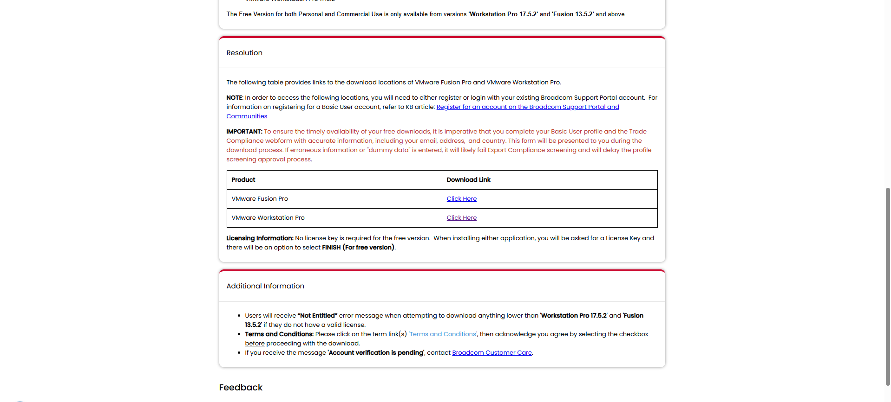
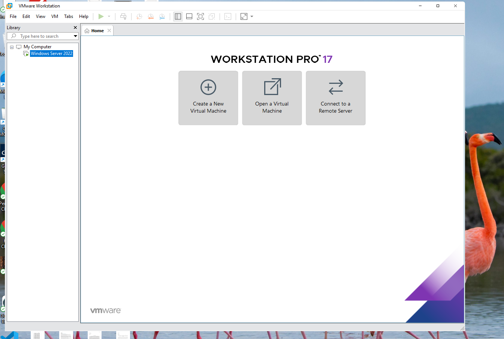
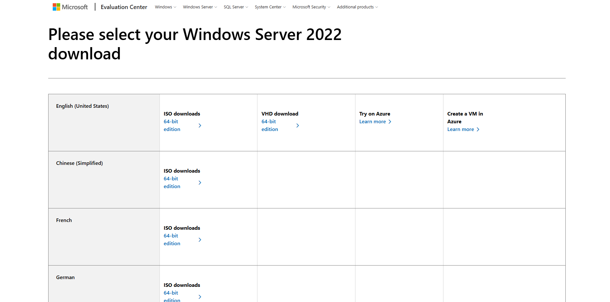
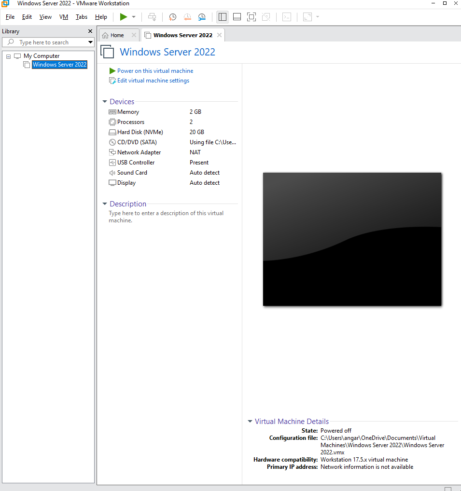
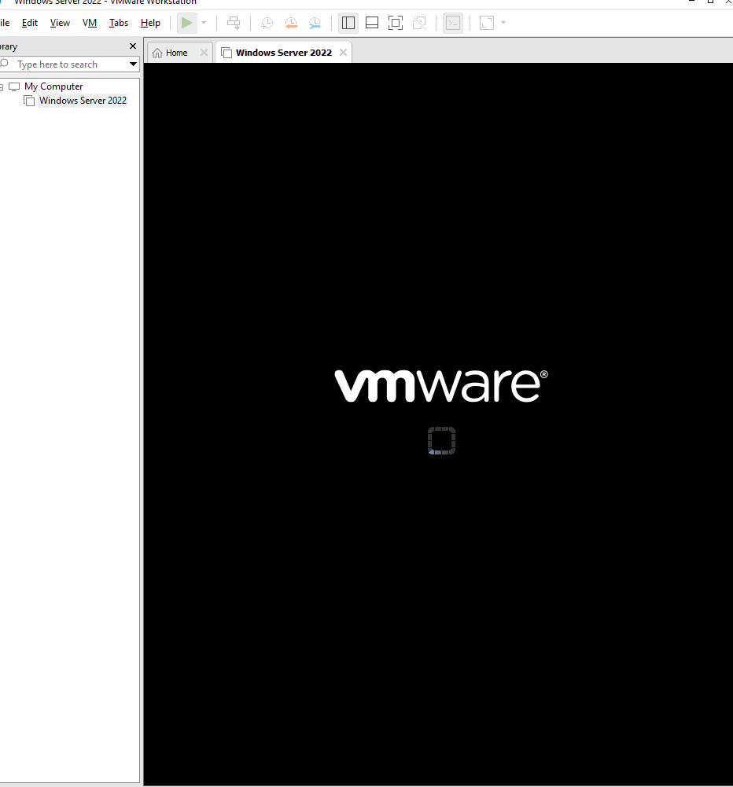
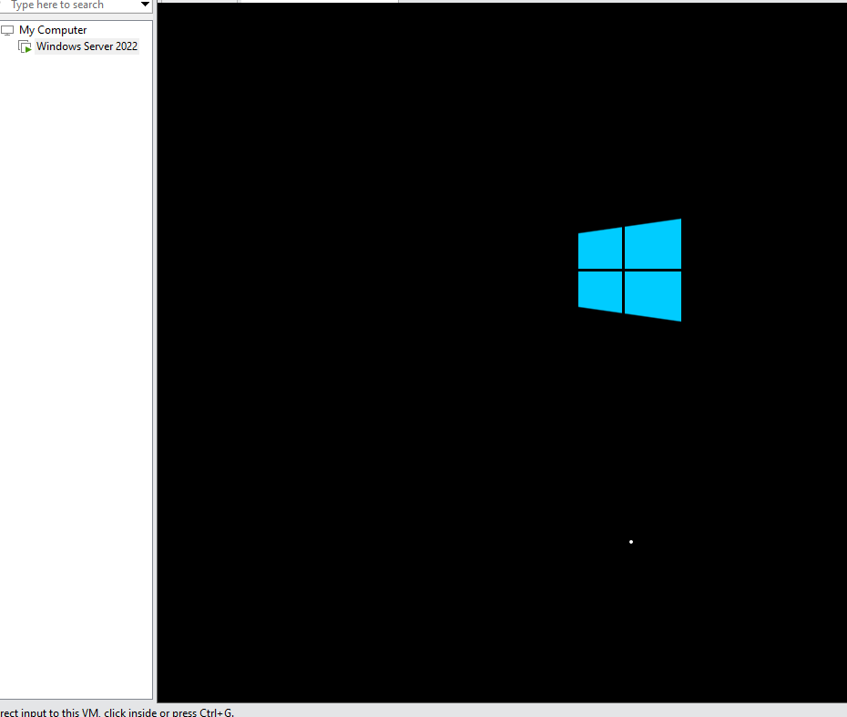
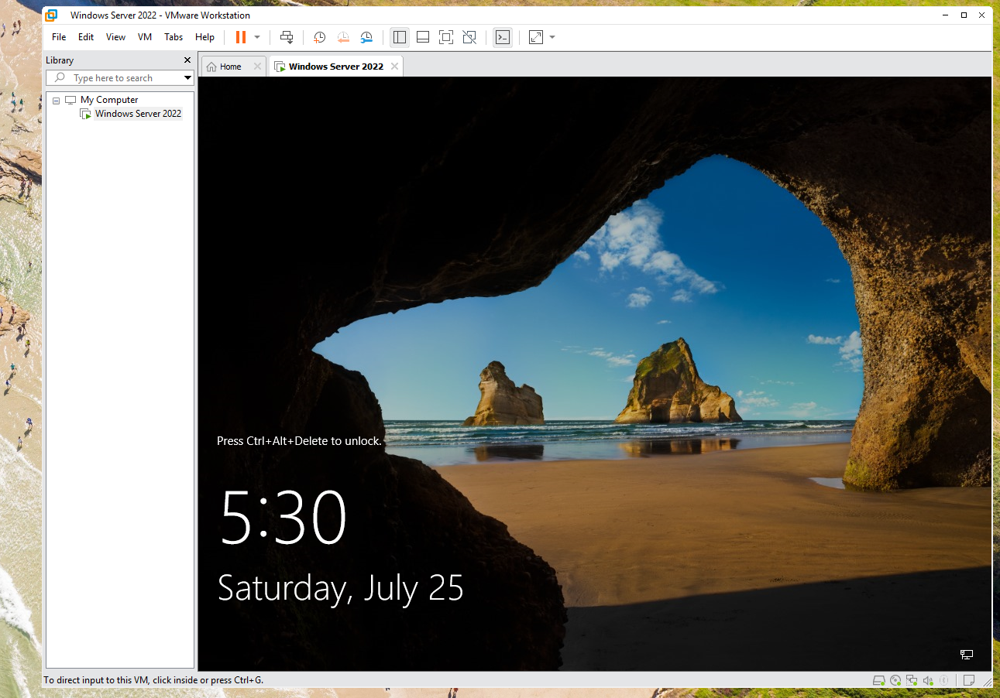
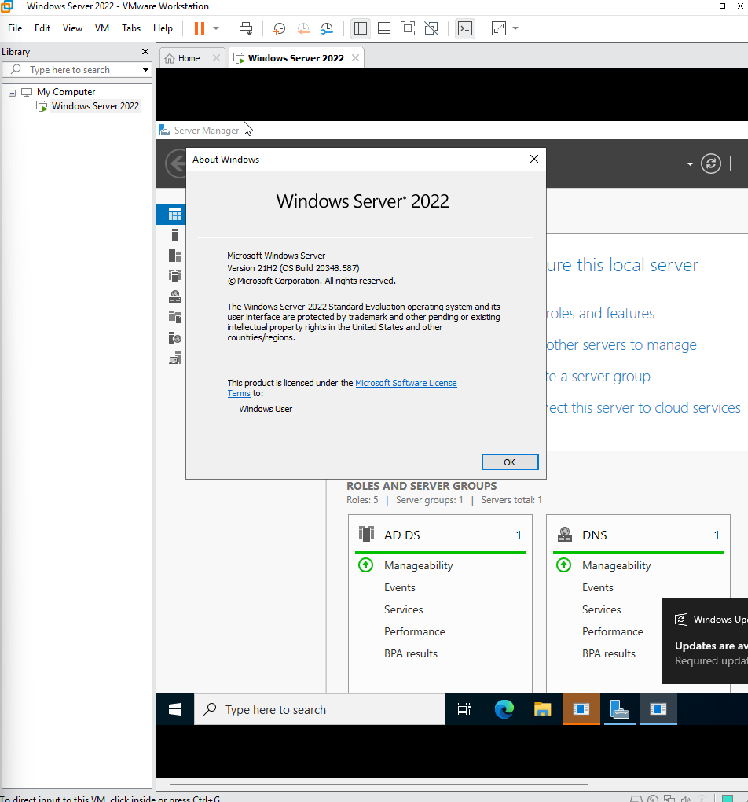
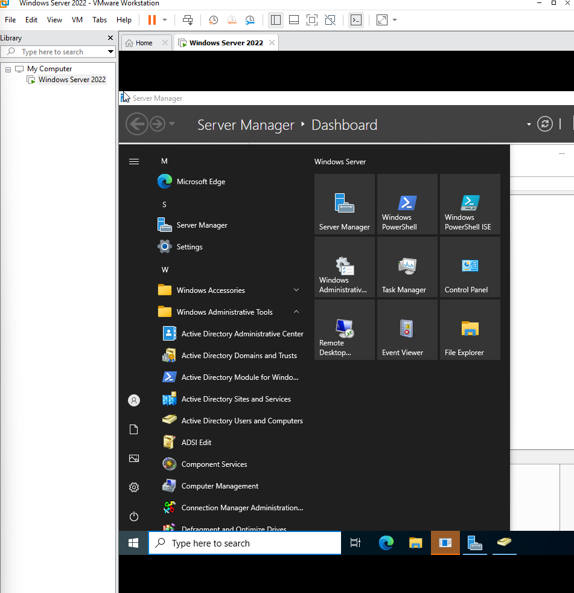
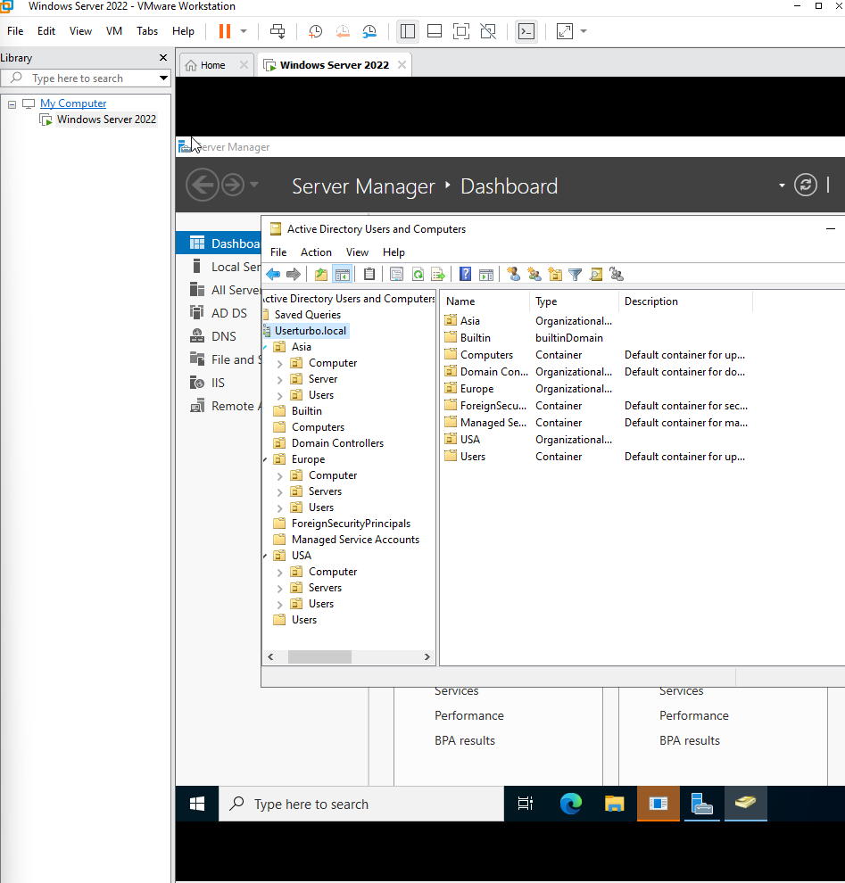

# AD Homelab - Detailed Setup Steps

## 1. Installing VMware Workstation

- Downloaded **VMware Workstation Player** (free version) from the official VMware site
- Ran the installer using all default settings — no custom configuration needed
- Launched VMware Workstation Player to confirm it installed correctly before moving on to creating a VM
- 

## 2. Windows Server ISO Download

- Downloaded Windows Server 2022 ISO from the official Microsoft Evaluation Center: https://www.microsoft.com/en-us/evalcenter/download-windows-server-2022
- Version: Windows Server 21H2 (OS Build 20348.587)
- Evaluation edition, valid for 180 days — sufficient for lab/testing purposes
- 
- 

- ## 3. Creating a New VM

- Opened VMware Workstation Player and selected "Create a New Virtual Machine"
- Chose "I will install the operating system later" to avoid VMware's automatic OS install (avoids setup issues)
- Selected Windows Server 2022 as the guest OS
- Allocated 20 GB of disk space
- Attached the Windows Server ISO via VM Settings > CD/DVD (SATA) > Browse

## 4. Installing Windows Server on the VM

- Powered on the VM and booted from the ISO (pressed a key quickly to boot from disc)
- Selected Windows Server 2022 Standard Evaluation (Desktop Experience) for the GUI
- Chose Custom install and accepted the default drive allocation
- Set the local administrator password
- Confirmed installed version using the `winver` command — Windows Server 21H2 (OS Build 20348.587)
- 

## 5. Installing Active Directory

- Opened Server Manager, went to **Manage > Add Roles and Features**
- Selected Role-based installation
- Selected **Active Directory Domain Services**, added required features (Group Policy Management included automatically)
- Ran the installation, then clicked **"Promote this server to a domain controller"**
- Created a new forest with domain name: **usertubro.local**
- Set Forest functional level, set Directory Services Restore Mode (DSRM) password
- Server rebooted and completed AD DS installation
- 

## 6. Basic AD Setup

### Creating Organizational Units (OUs)
- Opened **Active Directory Users and Computers**
- Right-clicked the domain > New > Organizational Unit
- Created top-level OUs by geography: **USA**, **Europe**, **Asia**
- Within each geographic OU, created sub-OUs for **Computers**, **Users**, and **Servers** to organize objects by category

### Creating Groups
- Learned the difference between **group scope** (Domain Local, Global, Universal) and **group type** (Security vs Distribution)
- Created department-based **security groups** to manage access: **IT, Accounting, HR, Sales, Management**
- Practiced creating a distribution group concept for email lists (e.g. DL-IT Admins)
### Creating Users
- Created user accounts under the appropriate OUs
- Set login names and passwords for each user

- ## 7. Configuring Group Policy Objects (GPOs)

### Reviewing Default Policies
- Opened Group Policy Management Console (GPMC) and reviewed the domain forest structure
- Reviewed the built-in Default Domain Controllers Policy

### Configuring Password Policy
- Edited the domain's Password Policy GPO
- Set Minimum password length to 14 characters
- Enabled password complexity requirements
- Set Maximum password age to 90 days

### Creating a Custom GPO (Drive Mapping)
- Created a new GPO named "Drive Mapping" linked to the domain
- Navigated to User Configuration > Preferences > Windows Settings > Drive Maps
- Configured a mapped network drive (E:) pointing to a shared folder path

